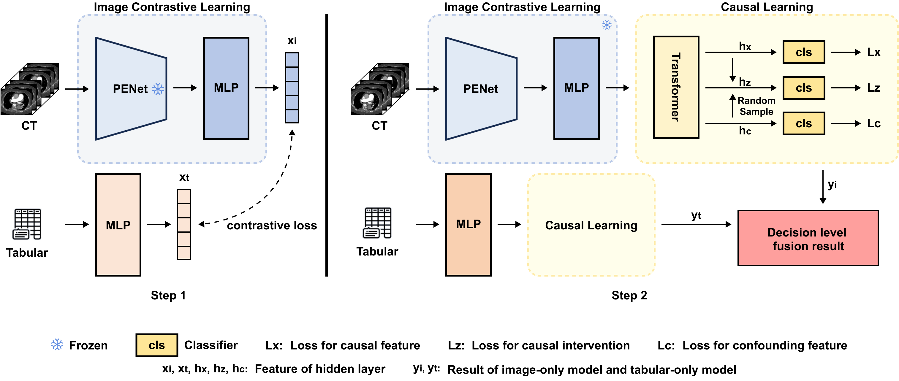

# GLOBAL ALIGNMENT IN CAUSAL LEARNING MODELS FOR IMAGE-TO-TABULAR DATA INTEGRATION IN PULMONARY EMBOLISM DIAGNOSIS


## Proposed method
You can find our code of this project in master branch.

We spend a lot of time collecting and summarizing relevant papers and datasets, where you can find them at https://github.com/Ivygugu/Pulmonary-Embolism-Detection/blob/main/README.md

This code is a pytorch implementation of our paper "GLOBAL ALIGNMENT IN CAUSAL LEARNING MODELS FOR IMAGE-TO-TABULAR DATA INTEGRATION IN PULMONARY EMBOLISM DIAGNOSIS".

Our method comprises the Image-only module guided by contrastive learning, the EHR-only module, and the classifier module based on causal learning. These modules cooperate to extract comprehensive and confounding-free features, which subsequently generate predictions for PE. The figure below shows our proposed network.



 ## Experiment result
   We compared to other state-of-the-art methods and our results are better than any other method of comparison. The results demonstrate that the introduced contrastive learning and causal learning strategies effectively capture the intrinsic correlations between the two modalities and eliminate confounding features in the extracted features, thus providing the model with richer and truly informative information.

### Results of Fusion Models
<table>
<thead>
  <tr>
    <th>Fusion Model</th>
    <th>AUROC</th>
    <th>ACC</th>
    <th>F1 score</th>
    <th>Sensitivity</th>
    <th>Specificity</th>
    <th>NPV</th>
    <th>PPV</th>
  </tr>
</thead>
<tbody>
  <tr>
    <td>PEFusion</td>
    <td>0.963</td>
    <td>0.907</td>
    <td>0.909</td>
    <td>0.929</td>
    <td>0.900</td>
    <td>0.911</td>
    <td>0.890</td>
  </tr>
  <tr>
    <td>PECon</td>
    <td>0.966</td>
    <td>0.920</td>
    <td>0.924</td>
    <td>0.963</td>
    <td>0.875</td>
    <td>0.959</td>
    <td>0.888</td>
  </tr>
  <tr>
    <td><b>CLPENet(Ours)</b></td>
    <td>0.968</td>
    <td>0.926</td>
    <td>0.929</td>
    <td>0.963</td>
    <td>0.887</td>
    <td>0.959</td>
    <td>0.898</td>
  </tr>
</tbody>
</table>

### Results of Image-only Models
<table>
<thead>
  <tr>
    <th>Image-only Model</th>
    <th>AUROC</th>
    <th>ACC</th>
    <th>F1 score</th>
    <th>Sensitivity</th>
    <th>Specificity</th>
    <th>NPV</th>
    <th>PPV</th>
  </tr>
</thead>
<tbody>
  <tr>
    <td>PEFusion-Image</td>
    <td>0.760</td>
    <td>0.759</td>
    <td>0.734</td>
    <td>0.862</td>
    <td>0.658</td>
    <td>0.830</td>
    <td>0.711</td>
  </tr>
  <tr>
    <td>PECon-Image</td>
    <td>0.831</td>
    <td>0.790</td>
    <td>0.800</td>
    <td>0.829</td>
    <td>0.750</td>
    <td>0.811</td>
    <td>0.773</td>
  </tr>
  <tr>
    <td><b>CLPENet-Image</b></td>
    <td>0.851</td>
    <td>0.802</td>
    <td>0.795</td>
    <td>0.756</td>
    <td>0.850</td>
    <td>0.773</td>
    <td>0.838</td>
  </tr>
</tbody>
</table>

### Results of Tabular-only Models
<table>
<thead>
  <tr>
    <th>Tabular-only Model</th>
    <th>AUROC</th>
    <th>ACC</th>
    <th>F1 score</th>
    <th>Sensitivity</th>
    <th>Specificity</th>
    <th>NPV</th>
    <th>PPV</th>
  </tr>
</thead>
<tbody>
  <tr>
    <td>PEFusion-Tabular</td>
    <td>0.858</td>
    <td>0.858</td>
    <td>0.853</td>
    <td>0.817</td>
    <td>0.900</td>
    <td>0.827</td>
    <td>0.893</td>
  </tr>
  <tr>
    <td>PECon-Tabular</td>
    <td>0.938</td>
    <td>0.907</td>
    <td>0.910</td>
    <td>0.927</td>
    <td>0.887</td>
    <td>0.922</td>
    <td>0.894</td>
  </tr>
  <tr>
    <td>Tabular(without cl)</td>
    <td>0.939</td>
    <td>0.909</td>
    <td>0.911</td>
    <td>0.929</td>
    <td>0.887</td>
    <td>0.922</td>
    <td>0.894</td>
  </tr>
  <tr>
    <td><b>CLPENet-Tabular</b></td>
    <td>0.942</td>
    <td>0.914</td>
    <td>0.917</td>
    <td>0.939</td>
    <td>0.887</td>
    <td>0.934</td>
    <td>0.895</td>
  </tr>
</tbody>
</table>

## Pre-requisties
* Linux

* Python>=3.7

* NVIDIA GPU (memory>=23G) + CUDA cuDNN

## Getting started to evaluate
### Install dependencies
```
pip install -r requirements.txt
```
### Download the checkpoint
Our model's best checkpoint is provided in this github, and you can use it to easily replicate our results.

### Data preprocess
The preprocessing of the image data can follow this link https://github.com/marshuang80/PENet
 In short, using create_hdf5.py to make an hdf5 file. As for the preprocessing of the tabular data, We first conduct dimensionality reduction using LinearSVC on the EMR data.

### Evaluation
To do the evaluation process, please run the following command :
```
sh test.sh
```
If you want to find the best threshold for the result, please run the following command :
```
python best_threshold.py
```

### Train by yourself
If you want to train by yourself, you can run this command :
```
sh train.sh
```

### Data
The data we used is from Stanford University Medical Center dataset. You can download it from https://stanfordaimi.azurewebsites.net/datasets/3a7548a4-8f65-4ab7-85fa-3d68c9efc1bd.

And the tabular data is already provided in this link.
